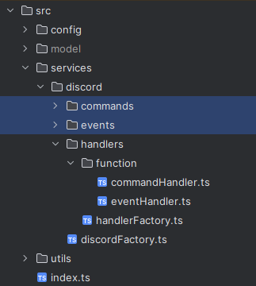

# Dícord bot template

## Requirements

- Node.js
- Discord.js

## Note

The `DiscordFactory` will autoload all of your Discord commands and events.

If you want to add more events or commands, you just need to put them all in the `events` and `commands` folders.



You will need to assign your handler/command/event path. The handler will run `commandHandler.ts` and `eventHandler.ts` to autoload all of your commands and events into the Discord client.

You can keep this as the default. However, if you need to refactor the code, you will need to update the location. For example:

```typescript
import { DiscordFactory } from "@service/discord/discordFactory";

const HANDLER_PATH = 'services/discord/handlers';
const COMMAND_PATH = "services/discord/commands";
const EVENT_PATH = "services/discord/events";

const discordFactory = new DiscordFactory(HANDLER_PATH, COMMAND_PATH, EVENT_PATH);

discordFactory.init();
```

## Update Dependency

   ```bash
   npm update
   yarn install
   ```

## How to Run the Project

1. Clone the repository:
   ```bash
   git clone https://github.com/your-username/discord-bot-template.git
   ```
2. Install dependencies:
   ```bash
   cd discord-bot-template
   yarn install
   ```
3. Set up the environment:
    - Create a file `.env` at the root of the project.
    - Fill in the required values in the `.env` file, such as your bot token
    - There is an example env file `.example.env`
    ```text
    DISCORD_TOKEN={Your Bot Token}
    AI_ACCESS_TOKEN={Your AI Access Token}
    ```
4. Start the bot:
   ```bash
   yarn start
   ```

## Documentation

For more detailed information on how to use and customize this Discord bot template, please refer to
the [documentation](https://link-to-documentation).

## Resources

- Discord.js
  Intents: [https://discordjs.guide/popular-topics/intents.html#privileged-intents](https://discordjs.guide/popular-topics/intents.html#privileged-intents)

> Let me know if there's anything else I can help you with!